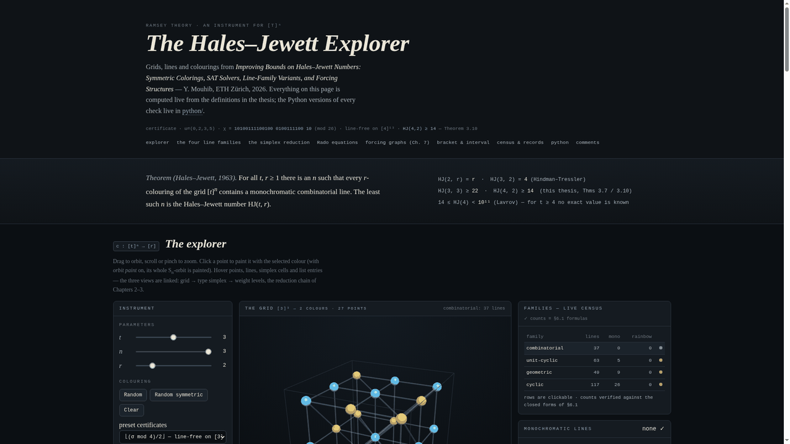

# The Hales–Jewett Explorer

An interactive companion to the thesis **“Improving Bounds on Hales–Jewett Numbers:
Symmetric Colorings, SAT Solvers, Line-Family Variants, and Forcing Structures”**
(Y. Mouhib, ETH Zürich, 2026).

Live site: **https://ysmouhib.github.io/hales-jewett-explorer/**

  

One self-contained page, `index.html`, that lets you

* explore the grid **[t]ⁿ** in 2D/3D for t ∈ {2,3,4}, n ∈ {1,2,3}, r ∈ {1,…,6}
  colours, with sliders for every parameter;
* draw and check the **four line families** of Chapter 6 — combinatorial,
  unit-cyclic, geometric, cyclic — under the **bracket L^[K]** and
  **interval L^(q)** restrictions of Chapter 4 (line counts are re-derived from
  the definitions and checked live against the closed forms of §6.1);
* generate colourings by class (Def. 2.6/2.8): **random**, **random symmetric**
  (a descent on the type simplex, Lemma 2.4), **one-weight c₍ω,χ₎** with an
  editable weight and palette, **sum-type**, plus eleven **preset certificates
  from the thesis** (Props 2.2, 3.14, 4.1, 4.5, 6.6; Thms 3.5, 3.10, 4.3, 4.10,
  4.11; the Table A.1 record slice via Lemma 3.3);
* paint points by hand (optionally whole Sₙ-orbits), and watch three linked
  views — the grid, the **type simplex with its corner tuples** (Lemma 3.1),
  and the **weight-level strip** where lines become homothets b + k·S_ω
  (Lemma 2.14);
* study the **forcing structures of Chapter 7**, live: the intersection graph
  G([t]ⁿ) with its induced edge colouring c̃(e) = c(x_e), the star dictionary
  (Lemma 7.5) and coherence classes (Prop. 7.6) — at t = 2 the Boolean-lattice
  comparability graph with its Mirsky chain (Prop. 7.1) — and the **corner
  hypergraph C⁽ᵗ⁾ₙ** with its pencils (Lemma 7.19), monochromatic corner
  tuples (Thm 7.21 ii), the clean cell-rainbow K_{t+1} of **Prop. 7.26** on a
  toggle, and the live Local-Lemma bound of Thm 7.28;
* read the **Rado panel (§2.4)**: the system E_s derived from your current
  weight (Prop. 2.19; the equation z + 2x = 3y for {0,1,3}, Example 2.20),
  exact counts of monochromatic forward homothets b + k·S (checked to agree
  with the grid, Lemma 2.14) versus reflected Rado-only copies — the gap of
  Remark 2.24, with R₄(z + 2x = 3y) ≥ 57 — and the Gallai rows of Table 2.1
  matched to your S₀ through the Thm 2.15 bound;
* leave **comments** (GitHub-issue-backed via utterances — see step 8);
* run exact tools in the browser: line-free verdicts with the monochromatic
  and rainbow lists, **Find line-free** / **Find diagonal-only** witnesses
  (backtracking), **Count symmetric line-free** on the simplex,
  **Count all line-free**, and **Min # monochromatic lines** — at
  (t,n,r) = (3,3,2) the counters return **1644** and **36**, reproducing
  Table A.5; at (3,2,2) cyclic, the minimum is **2** (Prop. 7.9).

Everything mathematical exists twice: in the page (JavaScript) and in
`python/hj.py`, and both are tested against the thesis’s numbers.

